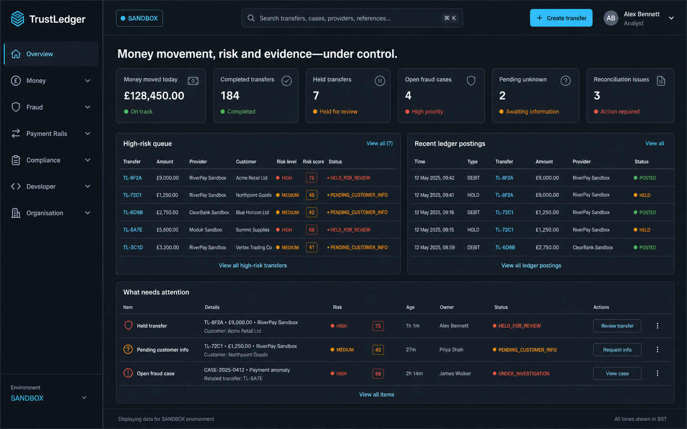
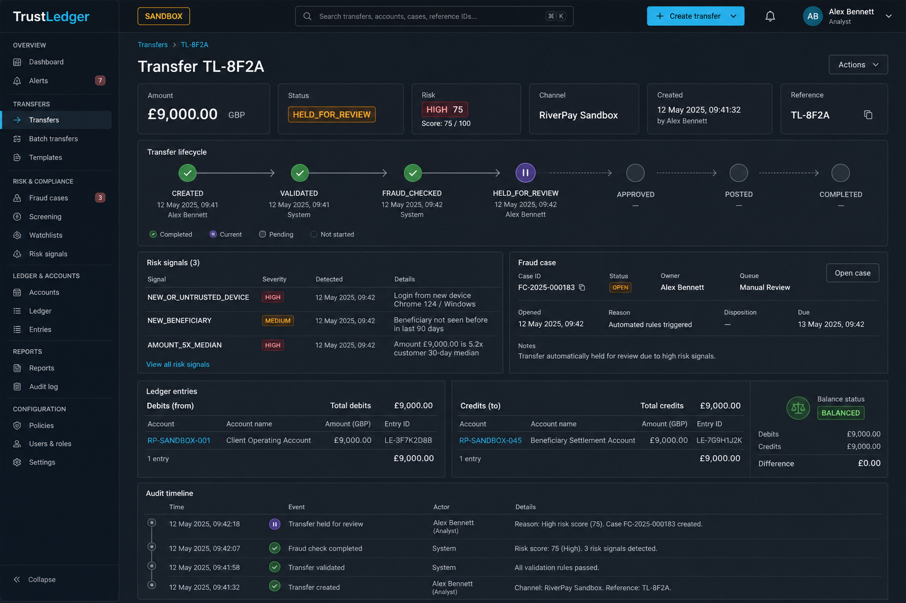
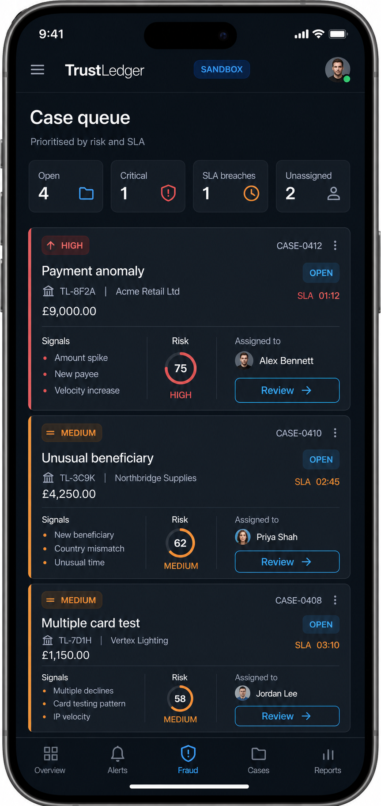
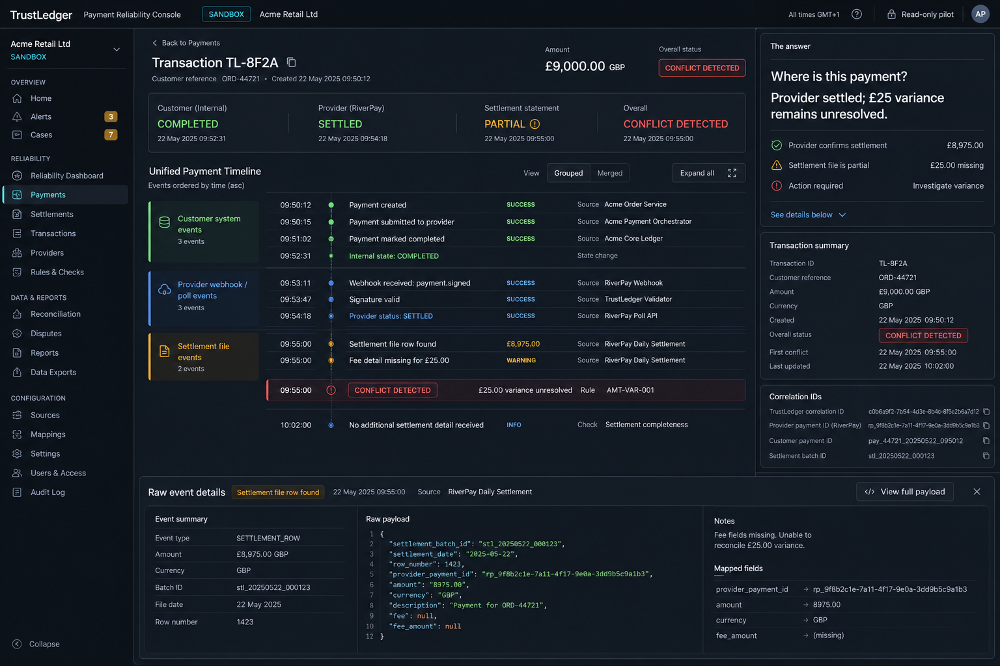

# TrustLedger interface image gallery

Polished design-reference mockups for the implemented TrustLedger console. These are bitmap
references, not substitutes for the working Next.js interfaces. All people, tenants, transfers,
providers and financial values shown are synthetic.

## Visual baseline

- Dark-first payment-operations console: deep slate, graphite/navy surfaces, restrained cyan.
- Status colour is always paired with a label, score or icon.
- Financial values use tabular numerals; ledger examples show balanced debits and credits.
- TrustLedger is presented as a control plane above providers, never as a bank, wallet or gateway.
- ML remains visibly advisory/shadow-only, and production-readiness claims remain evidence-bound.

## Fidelity source hierarchy

The generated references are not perfectly self-consistent: several screens use different logo marks,
sidebar expansion states, navigation wording and tenant/session placement. The working interface therefore
uses this hierarchy instead of mixing those variants:

1. The dashboard and implemented route map define the canonical shell and navigation names.
2. Each route image defines that route's information hierarchy, density and responsive composition.
3. State images define modal copy, safety friction and destructive-action emphasis.
4. Existing product behavior wins wherever a bitmap omits a required field or suggests an unsupported action.

The 2026-08-05 comparison found that the previous implementation matched palette more closely than
composition. The correction pass standardised the triple-bar brand, sandbox indicator, grouped sidebar,
top search/action/session order, authentication hierarchy, mobile card lists, one-time secret modal, typed
confirmations, MFA and held-for-review focus states. Exact pixel parity remains an image-diff task and is not
claimed by this gallery.

The complete per-route and per-state comparison is recorded in
[FIDELITY_AUDIT.md](FIDELITY_AUDIT.md).

## Route gallery

| Area | Interface | Route | Desktop | Mobile |
|---|---|---|---|---|
| Authentication | Login | `/login` | [desktop](desktop/login.png) | [mobile](mobile/login.png) |
| Overview | Dashboard | `/dashboard` | [desktop](desktop/dashboard.png) | [mobile](mobile/dashboard.png) |
| Overview | Onboarding | `/onboarding` | [desktop](desktop/onboarding.png) | [mobile](mobile/onboarding.png) |
| Money | Accounts | `/accounts` | [desktop](desktop/accounts.png) | [mobile](mobile/accounts.png) |
| Money | Transfers | `/transfers` | [desktop](desktop/transfers.png) | [mobile](mobile/transfers.png) |
| Money | Create transfer | `/transfers/new` | [desktop](desktop/create-transfer.png) | [mobile](mobile/create-transfer.png) |
| Money | Transfer detail | `/transfers/[transactionId]` | [desktop](desktop/transfer-detail.png) | [mobile](mobile/transfer-detail.png) |
| Money | Ledger explorer | `/ledger` | [desktop](desktop/ledger.png) | [mobile](mobile/ledger.png) |
| Reconciliation | Issues | `/reconciliation` | [desktop](desktop/reconciliation.png) | [mobile](mobile/reconciliation.png) |
| Reconciliation | Issue detail | `/reconciliation/[issueId]` | [desktop](desktop/reconciliation-detail.png) | [mobile](mobile/reconciliation-detail.png) |
| Reconciliation | Settlement statements | `/reconciliation/statements` | [desktop](desktop/settlement-statements.png) | [mobile](mobile/settlement-statements.png) |
| Reconciliation | Statement detail | `/reconciliation/statements/[id]` | [desktop](desktop/settlement-statement-detail.png) | [mobile](mobile/settlement-statement-detail.png) |
| Fraud | Case queue | `/fraud-cases` | [desktop](desktop/fraud-cases.png) | [mobile](mobile/fraud-cases.png) |
| Fraud | Risk profiles | `/risk-profiles` | [desktop](desktop/risk-profiles.png) | [mobile](mobile/risk-profiles.png) |
| Fraud | ML monitoring | `/ml` | [desktop](desktop/ml-monitoring.png) | [mobile](mobile/ml-monitoring.png) |
| Payment rails | Webhook events | `/webhooks` | [desktop](desktop/webhooks.png) | [mobile](mobile/webhooks.png) |
| Payment rails | Provider certifications | `/certifications` | [desktop](desktop/certifications.png) | [mobile](mobile/certifications.png) |
| Payment rails | Certification run | `/certifications/[runId]` | [desktop](desktop/certification-run.png) | [mobile](mobile/certification-run.png) |
| Payment rails | Production readiness | `/production-readiness` | [desktop](desktop/production-readiness.png) | [mobile](mobile/production-readiness.png) |
| Compliance | Evidence exports | `/evidence` | [desktop](desktop/evidence.png) | [mobile](mobile/evidence.png) |
| Compliance | Audit logs | `/audit-logs` | [desktop](desktop/audit-logs.png) | [mobile](mobile/audit-logs.png) |
| Developer | API keys | `/developer/api-keys` | [desktop](desktop/api-keys.png) | [mobile](mobile/api-keys.png) |
| Developer | Monitoring | `/monitoring` | [desktop](desktop/monitoring.png) | [mobile](mobile/monitoring.png) |
| Organisation | Tenant admin | `/admin` | [desktop](desktop/tenant-admin.png) | [mobile](mobile/tenant-admin.png) |
| Organisation | Users and roles | `/users` | [desktop](desktop/users.png) | [mobile](mobile/users.png) |
| Organisation | Org units | `/org-units` | [desktop](desktop/org-units.png) | [mobile](mobile/org-units.png) |

## Critical interaction states

| State | Image |
|---|---|
| Create transfer — risk preview | [view](states/transfer-risk-preview.png) |
| Create transfer — MFA challenge | [view](states/transfer-mfa.png) |
| Transfer detail — held for review | [view](states/transfer-held-review.png) |
| Fraud case — typed approval | [view](states/fraud-approve-confirmation.png) |
| Reconciliation issue — typed resolution | [view](states/reconciliation-resolve-confirmation.png) |
| API key — secret shown once | [view](states/api-key-secret.png) |
| Production readiness — controlled exposure | [view](states/production-exposure-confirmation.png) |
| Global command palette | [view](states/command-palette.png) |

## Representative previews

### Dashboard

### Transfer investigation

### Mobile fraud queue

## Payment Reliability Console expansion

This expansion visualises the Moonshot Programme's initial read-only commercial wedge. These are
future-facing design references and do not claim that matching application routes are implemented.

| Capability | Desktop | Mobile |
|---|---|---|
| Unified cross-provider payment timeline | [desktop](expansion/desktop/unified-payment-timeline.png) | [mobile](expansion/mobile/unified-payment-timeline.png) |
| Provider reliability scorecard | [desktop](expansion/desktop/provider-reliability.png) | [mobile](expansion/mobile/provider-reliability.png) |
| Advanced reconciliation workbench | [desktop](expansion/desktop/reconciliation-workbench.png) | [mobile](expansion/mobile/reconciliation-workbench.png) |
| Exception collaboration workspace | [desktop](expansion/desktop/exception-collaboration.png) | [mobile](expansion/mobile/exception-collaboration.png) |
| Daily payment-operations report | [desktop](expansion/desktop/daily-operations-report.png) | [mobile](expansion/mobile/daily-operations-report.png) |
| Controlled-pilot metrics | [desktop](expansion/desktop/pilot-metrics.png) | [mobile](expansion/mobile/pilot-metrics.png) |

### Operator states

| State | Image |
|---|---|
| Assign exception ownership and SLA | [view](expansion/states/assign-exception.png) |
| Request supporting evidence | [view](expansion/states/request-evidence.png) |
| Maker-checker resolution review | [view](expansion/states/maker-checker-resolution.png) |
| Escalate provider dispute | [view](expansion/states/provider-dispute.png) |

### Expansion preview

## Generation notes

Generated with the built-in image-generation path using one `ui-mockup` prompt per asset. Each
prompt specified the route purpose, device, required TrustLedger vocabulary, synthetic data,
financial invariants, safety copy and shared visual baseline. The three premise-gate interfaces
(Dashboard, Transfer Detail and Fraud Cases) were generated and inspected before the remaining
domain batches.
